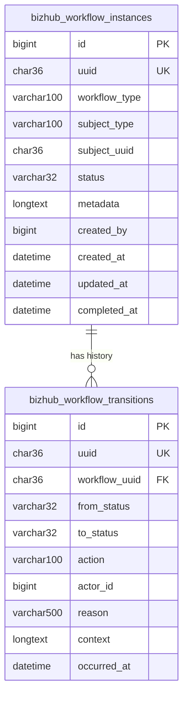

# Entity-Relationship Diagram

## Notes on this diagram

- The `FK` annotation on `bizhub_workflow_transitions.workflow_uuid` denotes a **logical** reference to `bizhub_workflow_instances.uuid`, not a database-enforced `FOREIGN KEY` constraint — see `Relationships.md` for why (primarily `dbDelta()` compatibility).
- `bizhub_workflow_instances.subject_uuid` is not shown relating to any other entity in this diagram because it references a business subject (e.g. a `BizHub\Companies` company) owned by a different module/plugin entirely, outside this schema's boundary. The workflow engine treats it as an opaque identifier, never joining against it directly.
- This is the complete schema this plugin owns — two tables, one relationship. There is no `bizhub_workflow_notifications`, `bizhub_workflow_jobs`, or similar table; notification templates and event registries live in PHP config files (`config/notifications.php`, `config/events.php`), not the database (see `docs/architecture/Notification-Architecture.md`).
