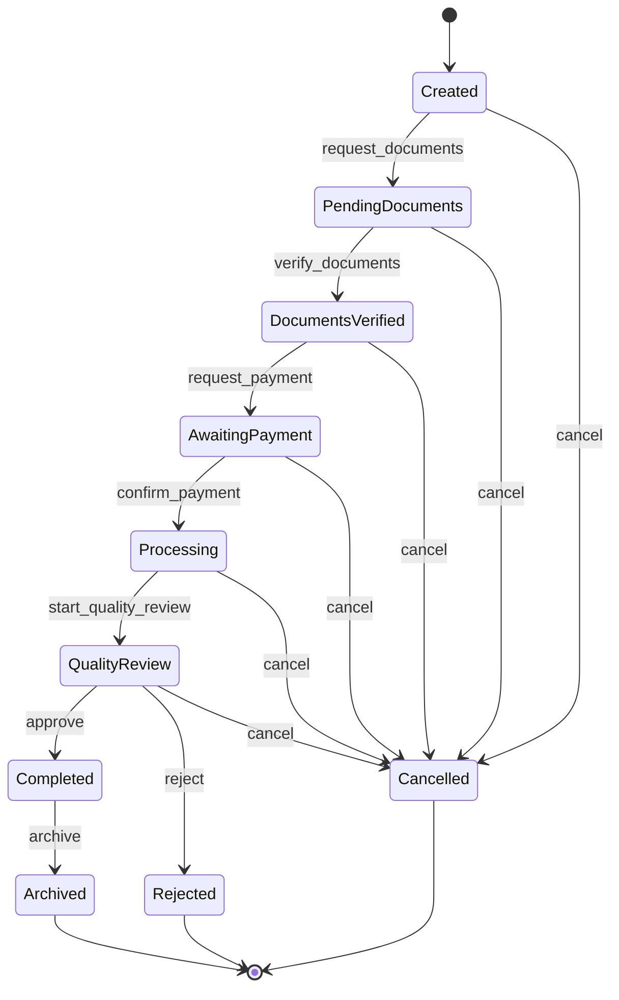

# Company Registration Workflow

**Status: implemented.** This is the one workflow type actually built on the engine today, defined in `BizHub\Workflow\Workflows\CompanyRegistration\CompanyRegistrationDefinition`, guarded by `CompanyRegistrationGuard`, and orchestrated by `CompanyRegistrationService`. Exercised end-to-end by `tests/Workflow/CompanyRegistrationWorkflowTest.php`.

## Type identifier

`CompanyRegistrationDefinition::TYPE = 'company_registration'`. Subject: `subject_type = 'company'`, `subject_uuid` = a `BizHub\Companies` company's UUID.

## The nine actions and the state graph

Initial status: `Created`. Nine actions, each an `ACTION_*` constant on `CompanyRegistrationDefinition`:

| Action | From | To |
|---|---|---|
| `request_documents` | Created | PendingDocuments |
| `verify_documents` | PendingDocuments | DocumentsVerified |
| `request_payment` | DocumentsVerified | AwaitingPayment |
| `confirm_payment` | AwaitingPayment | Processing |
| `start_quality_review` | Processing | QualityReview |
| `approve` | QualityReview | Completed |
| `archive` | Completed | Archived |
| `reject` | QualityReview | Rejected |
| `cancel` | Created, PendingDocuments, DocumentsVerified, AwaitingPayment, Processing, QualityReview | Cancelled |

## Guard preconditions (`CompanyRegistrationGuard`)

Three of the nine actions have a business-rule precondition, enforced *in addition to* structural validity:

| Action | Precondition | Failure |
|---|---|---|
| `verify_documents` | `context['documents_verified'] === true` | `PreconditionFailedException`: "Documents cannot be verified until they have been reviewed and confirmed complete." |
| `confirm_payment` | `context['payment_reference']` is a non-empty, trimmed string | `PreconditionFailedException`: "A payment reference is required to confirm payment has been received." |
| `approve` | `context['reviewed_by']` is a non-empty, trimmed string | `PreconditionFailedException`: "Quality review approval must record who performed the review." |

The remaining six actions (`request_documents`, `request_payment`, `start_quality_review`, `archive`, `cancel`, `reject`) have no guard — only structural (state-machine) validity applies.

## Events raised

Every action dispatches `WorkflowTransitioned`. `approve` additionally dispatches `WorkflowCompleted` (its target, `Completed`, is the workflow's successful conclusion — `completedAt` is stamped here, not at `archive`). `cancel` and `reject` additionally dispatch `WorkflowCancelled` (both are terminal-but-unsuccessful). Starting the workflow (`CompanyRegistrationService::start()`) dispatches `WorkflowCreated`. Rollback dispatches `WorkflowRolledBack`.

## Notifications

`config/notifications.php` defines a `{subject, body}` template for seven actions (all except `start_quality_review` and `archive`), sent to the workflow's creator on `in_app` + `email` channels via `WorkflowNotificationListener`. See `docs/architecture/Notification-Architecture.md` for exact template text.

## Rollback behaviour

`rollback()` reverts exactly one step — to the `from` status of the most recently recorded transition — and is unavailable once the instance is terminal (`Archived`/`Cancelled`/`Rejected`) or has no prior transition. It is not scoped to specific statuses beyond that; any non-terminal Company Registration can be rolled back one step.

## Completion criteria

Successful completion is reaching `Completed` (via `approve`), optionally followed by `archive` to `Archived` for housekeeping — both `isSuccessful() === true`. Unsuccessful conclusion is `Cancelled` (via `cancel`, from any non-terminal status) or `Rejected` (via `reject`, only from `QualityReview`).

## Audit logging

Every `create()`/`transition()`/`rollback()` call logs a structured entry (`bizupkeep_workflow.created`/`.transitioned`/`.rolled_back`) and writes a durable row to `bizhub_workflow_transitions` — see `docs/security/Audit.md` for exact fields.

## Cross-module rule enforced by `CompanyRegistrationService`

`start(string $companyUuid, int $userId)` requires the company to actually exist (`CompanyServiceInterface::getCompany()`, throwing `CompanyNotFoundException` if not) — a rule the generic engine itself has no way to express, since it knows nothing about `BizHub\Companies`.
