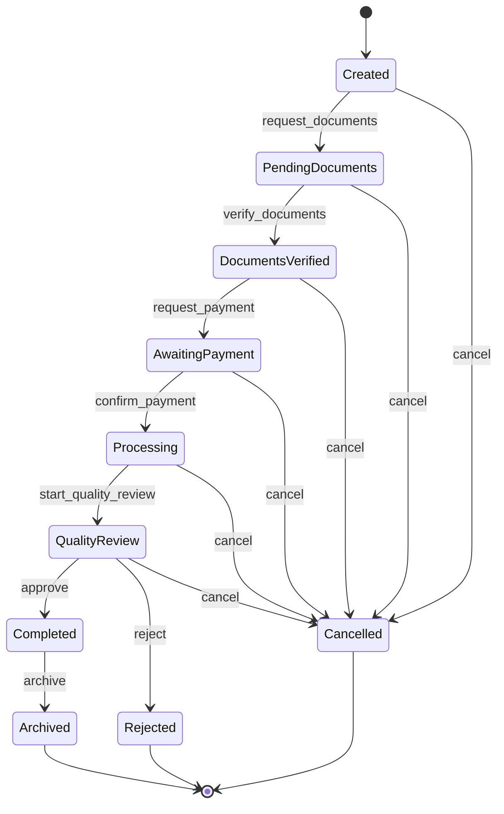
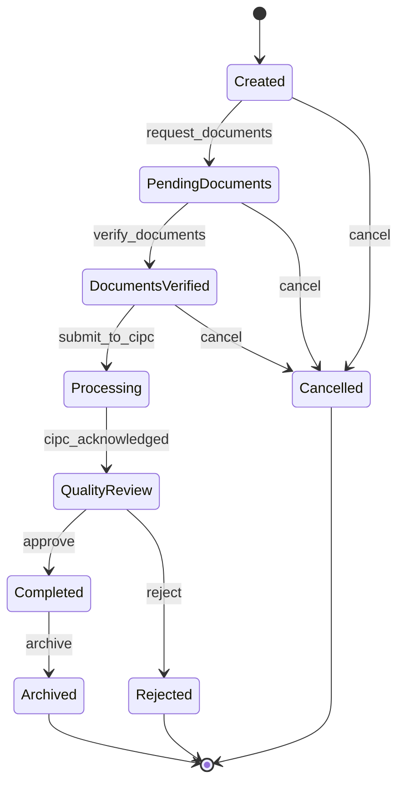
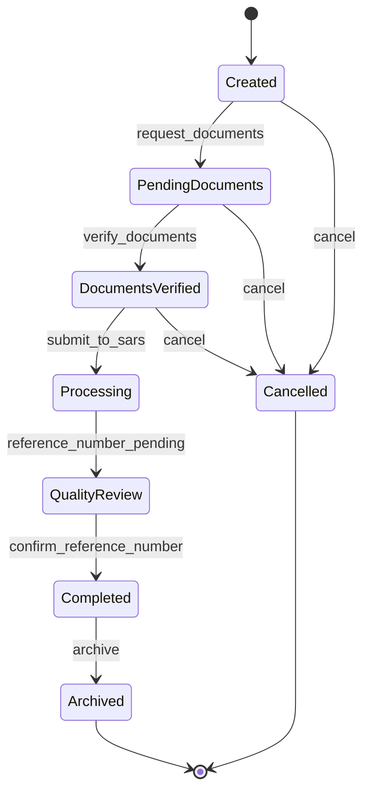
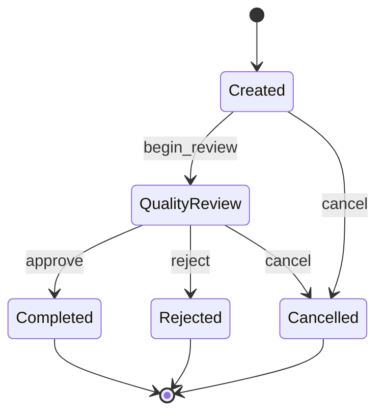
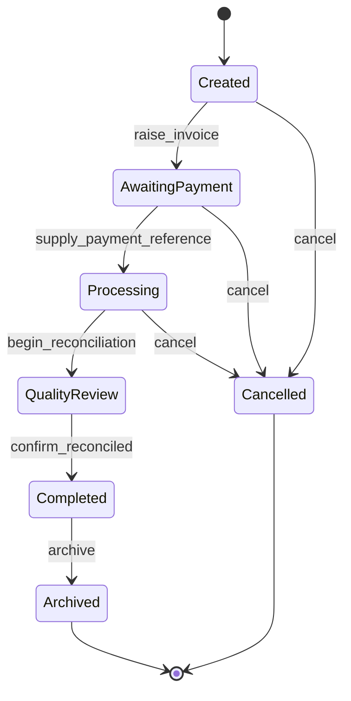

# Workflow State Diagrams

Mermaid state diagrams for the one implemented workflow type and a sample of the specified-but-unbuilt ones. See each workflow's own document in this directory for full Input/Validation/Preconditions/Business Rules/Events/Notifications/Rollback/Completion/Audit detail.

## Company Registration — implemented

Reproduced from `Company-Registration.md`; the authoritative source is `CompanyRegistrationDefinition::transitionRules()`.

## Director Changes — specified, not implemented

Per `Director-Changes.md`'s proposed lifecycle.

## Tax Registration — specified, not implemented

Per `Tax-Registration.md`'s proposed lifecycle.

## Approval Workflow — specified, not implemented

Per `Approval-Workflow.md`'s proposed lifecycle — notably shorter, since it models a single sign-off decision rather than a multi-stage filing process.

## Payment Workflow — specified, not implemented

Per `Payment-Workflow.md`'s proposed lifecycle — note the extra `QualityReview` (reconciliation) step distinguishing "payment reference supplied" from "payment actually cleared," a distinction Company Registration's simpler `confirm_payment` guard currently collapses into one step.

## Reading these diagrams

Every diagram here uses the same ten `WorkflowStatus` enum cases the engine actually defines (see `docs/architecture/State-Machine.md`) — no specified workflow introduces a new status value, since the engine's `WorkflowStatus` enum is shared across every workflow type by design. Action names on specified (unbuilt) diagrams are illustrative proposals, not yet-defined `ACTION_*` constants — only Company Registration's action names are real, copied verbatim from `CompanyRegistrationDefinition`.
